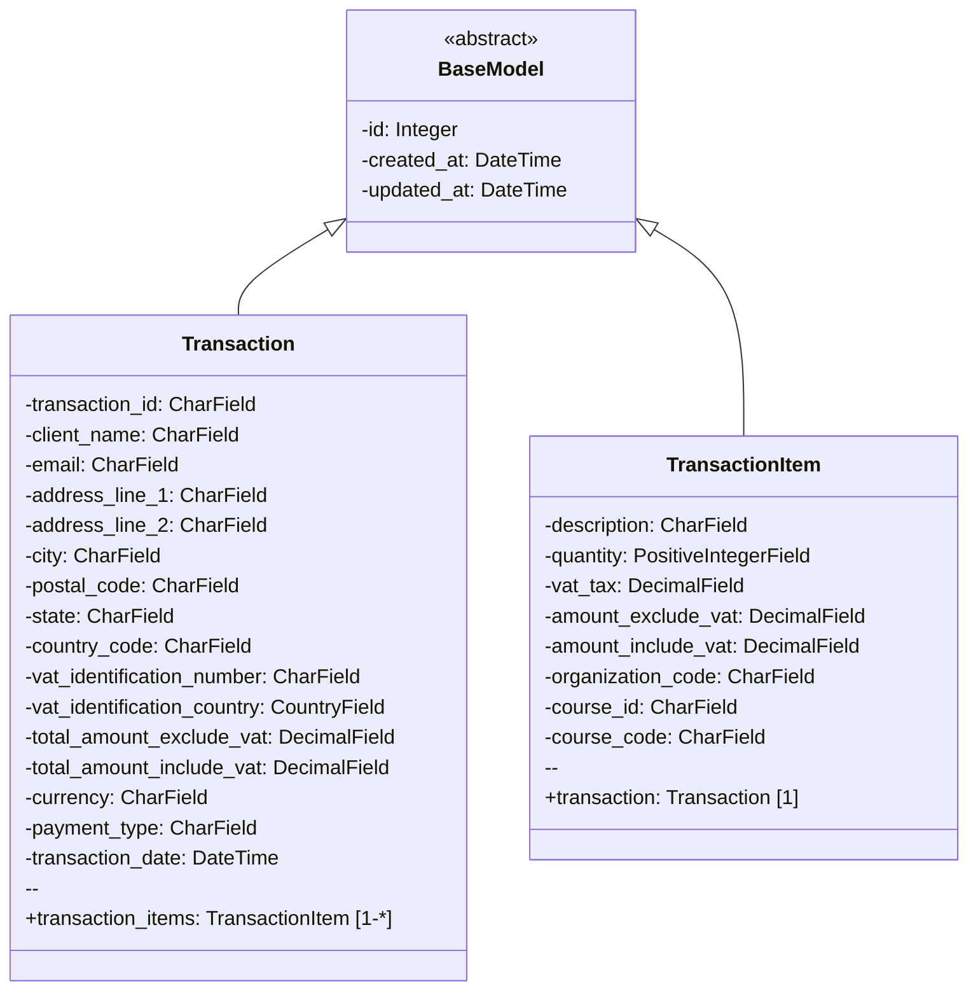

# Billing Module

Descripton:
This module is responsible for handling billing and transactions.

## ERD of models

```mermaid
classDiagram
    class BaseModel {
        <<abstract>>
        -id: Integer
        -created_at: DateTime
        -updated_at: DateTime
    }
    class Transaction {
        -transaction_id: CharField
        -client_name: CharField
        -email: CharField
        -address_line_1: CharField
        -address_line_2: CharField
        -city: CharField
        -postal_code: CharField
        -state: CharField
        -country_code: CharField
        -vat_identification_number: CharField
        -vat_identification_country: CountryField
        -total_amount_exclude_vat: DecimalField
        -total_amount_include_vat: DecimalField
        -currency: CharField
        -payment_type: CharField
        -transaction_date: DateTime
        --
        +transaction_items: TransactionItem [1-*]
    }
    class TransactionItem {
        -description: CharField
        -quantity: PositiveIntegerField
        -vat_tax: DecimalField
        -amount_exclude_vat: DecimalField
        -amount_include_vat: DecimalField
        -organization_code: CharField
        -course_id: CharField
        -course_code: CharField
        --
        +transaction: Transaction [1]
    }
    BaseModel <|-- Transaction
    BaseModel <|-- TransactionItem
```
