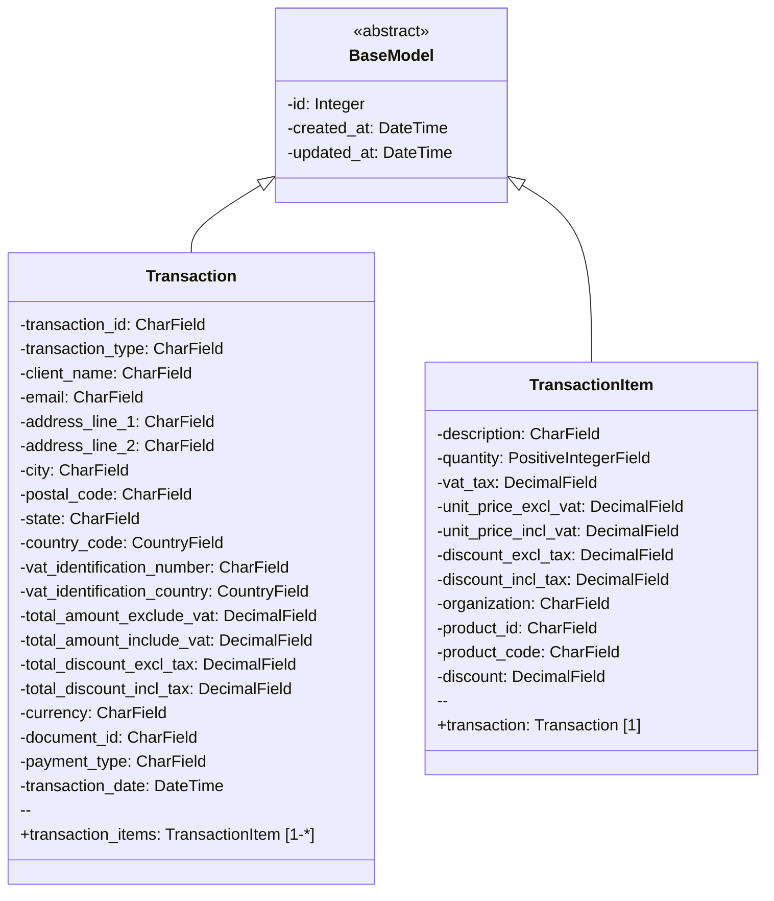

# Billing Module

Description:
This module is responsible for handling billing and transactions.

## ERD of models

```mermaid
classDiagram
    class BaseModel {
        <<abstract>>
        -id: Integer
        -created_at: DateTime
        -updated_at: DateTime
    }
    class Transaction {
        -transaction_id: CharField
        -transaction_type: CharField
        -client_name: CharField
        -email: CharField
        -address_line_1: CharField
        -address_line_2: CharField
        -city: CharField
        -postal_code: CharField
        -state: CharField
        -country_code: CountryField
        -vat_identification_number: CharField
        -vat_identification_country: CountryField
        -total_amount_exclude_vat: DecimalField
        -total_amount_include_vat: DecimalField
        -total_discount_excl_tax: DecimalField
        -total_discount_incl_tax: DecimalField
        -currency: CharField
        -document_id: CharField
        -payment_type: CharField
        -transaction_date: DateTime
        --
        +transaction_items: TransactionItem [1-*]
    }
    class TransactionItem {
        -description: CharField
        -quantity: PositiveIntegerField
        -vat_tax: DecimalField
        -unit_price_excl_vat: DecimalField
        -unit_price_incl_vat: DecimalField
        -discount_excl_tax: DecimalField
        -discount_incl_tax: DecimalField
        -organization: CharField
        -product_id: CharField
        -product_code: CharField
        -discount: DecimalField
        --
        +transaction: Transaction [1]
    }
    BaseModel <|-- Transaction
    BaseModel <|-- TransactionItem
```
