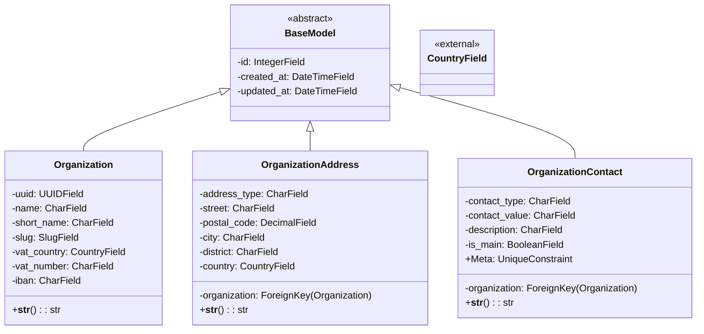

# Organization Module

Descripton:
This modules is responsible for handling informations of organizations.

## ERD of models

```mermaid
classDiagram
    class BaseModel {
        <<abstract>>
        -id: IntegerField
        -created_at: DateTimeField
        -updated_at: DateTimeField
    }
    class CountryField {
        <<external>>
    }
    class Organization {
        -uuid: UUIDField
        -name: CharField
        -short_name: CharField
        -slug: SlugField
        -vat_country: CountryField
        -vat_number: CharField
        -iban: CharField
        +__str__(): str
    }
    class OrganizationAddress {
        -organization: ForeignKey(Organization)
        -address_type: CharField
        -street: CharField
        -postal_code: DecimalField
        -city: CharField
        -district: CharField
        -country: CountryField
        +__str__(): str
    }
    class OrganizationContact {
        -organization: ForeignKey(Organization)
        -contact_type: CharField
        -contact_value: CharField
        -description: CharField
        -is_main: BooleanField
        +__str__(): str
        +Meta: UniqueConstraint
    }
    BaseModel <|-- Organization
    BaseModel <|-- OrganizationAddress
    BaseModel <|-- OrganizationContact
```
