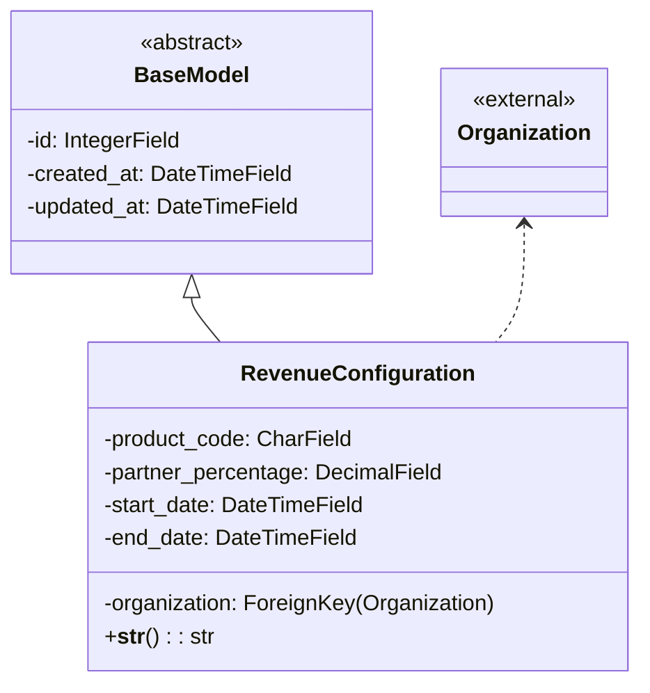

# Shared Revenue Module

Descripton:
This module is responsible for handling shared revenue between organizations.

## ERD of models

```mermaid
classDiagram
    class BaseModel {
        <<abstract>>
        -id: IntegerField
        -created_at: DateTimeField
        -updated_at: DateTimeField
    }
    class Organization {
        <<external>>
    }
    class RevenueConfiguration {
        -organization: ForeignKey(Organization)
        -product_code: CharField
        -partner_percentage: DecimalField
        -start_date: DateTimeField
        -end_date: DateTimeField
        +__str__(): str
    }
    BaseModel <|-- RevenueConfiguration
    Organization <.. RevenueConfiguration
```
