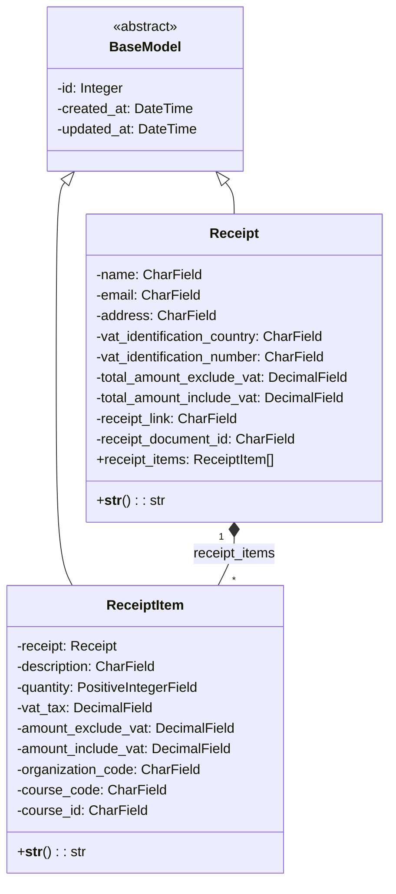

# Billing Module

Descripton:
This module is responsible for handling billing and receipts.

## ERD of models

```mermaid
classDiagram
    class BaseModel {
        <<abstract>>
        -id: Integer
        -created_at: DateTime
        -updated_at: DateTime
    }
    class Receipt {
        -name: CharField
        -email: CharField
        -address: CharField
        -vat_identification_country: CharField
        -vat_identification_number: CharField
        -total_amount_exclude_vat: DecimalField
        -total_amount_include_vat: DecimalField
        -receipt_link: CharField
        -receipt_document_id: CharField
        +receipt_items: ReceiptItem[]
        +__str__(): str
    }
    class ReceiptItem {
        -receipt: Receipt
        -description: CharField
        -quantity: PositiveIntegerField
        -vat_tax: DecimalField
        -amount_exclude_vat: DecimalField
        -amount_include_vat: DecimalField
        -organization_code: CharField
        -course_code: CharField
        -course_id: CharField
        +__str__(): str
    }
    BaseModel <|-- Receipt
    BaseModel <|-- ReceiptItem
    Receipt "1" *-- "*" ReceiptItem : receipt_items
```
